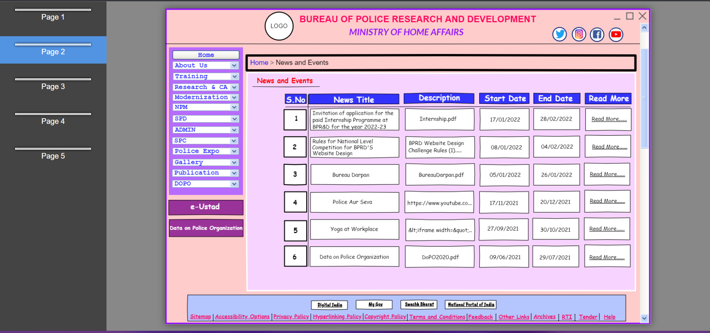

# Wire frame for a website

## AIM:
To design a wire frame for a website.

## DESIGN STEPS:

### Step 1:  
Create a New document.

### Step 2:
Resize Canvas with dimension of  1024 as width and 768 height.

### Step 3:
Use the given web elements to design the wireframe of a website .

### Step 4:
Using "Link to" option link hyperlink,button with other pages.

### Step 5:
Save the document and export the file as Single web page with Clickable Prototype HTML Template.

## OUTPUT:

## Home Page:
 

## News and Events Page:
 

## Message Page:
 

## Data on Police Organization Page:

## Smart Policing Page:
 

## HTML Doc page (Clickable Prototype HTML Template):
 
 
 
 
 

## Result:
Thus a wire frame is designed for a given website.
